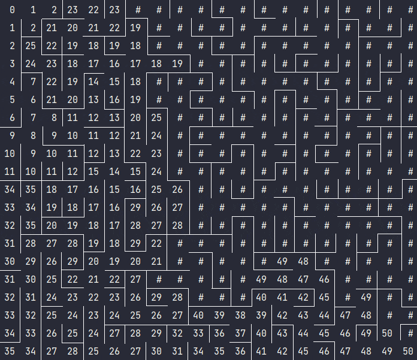

# Wave-Algorithm-CPP-Python

---

---

> Волновой алгоритм — это алгоритм поиска пути, который использует волновое распространение для определения кратчайшего пути от начальной вершины до целевой вершины.
> 
> Название алгоритму дано не случайно, поведение алгоритма соответствует распространению волны, волна огибает препятствия, постепенно заполняя все пространство
> 
> Всем привет! Меня зовут Нурислам (aka tonitaga), я участник School21 и сегодня я бы вам хотел рассказать о Волновом алгоритме.

---

## Правила волнового алгоритма

Волновой алгоритм разделяется на три этапа:

1) Первичная инициализация
2) Распространение волны
3) Восстановление пути

---

### Первичная инициализация

* Для правильной работы алгоритма, мы в первую очередь должны инициализировать переменные начальными значениями

* Матрица длин (length_map) — это самое главное в этом алгоритме, по нему мы и будет находить кратчайший путь. У этой матрицы будет всего два типа значений: -1 (Если волна еще не была в этой клетке) и "неотрицательное число" - расстояние от начальной точки до текущей.
* Клетка старта в матрице длин будет помечена как 0, так как расстояние от начальной клетки до начальной и есть 0. От этой клетки и начнется распространение волны.
* Также нужны две волны, текущая и предыдущая (стартовая) от которой получается текущая волна, соответсвенно wave и old_wave
* old_wave будет иметь в самом начале лишь одну точку распространения волны, а именно стартовую.

---

### Распространение волны

* Постепенно от каждой точки в old_wave распространяется в возможные клетки, к которых ранее еще не были, новые клетки сохраняем в wave

---

### Восстановление пути

* Волновой алгоритм находит все пути сразу, но нам нужен именно кратчайший путь

* Для того чтобы получить его, там нужно итеративно вернуться из точки финиша в точку старта, для того чтобы это сделать будем использовать матрицу длин.

* Зная значения в матрице длин, будем постепенно возвращаться, чтобы понять куда нам идти (вверх, вниз, вправо, влево), нужно всего лишь сравнить значение текущей клетки и клетки направления, и если клетка направления имеет число меньше чем текущее на 1, то это и есть наш путь.

* Путь будем искать пока не дойдем до начальной точки (вспомним, что начальную точку в матрице длин мы инициализировали нулем)

  

